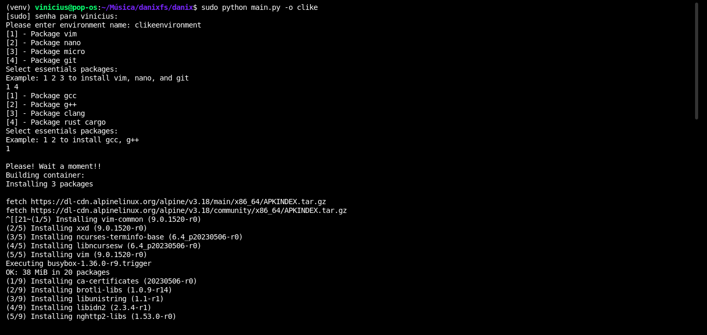
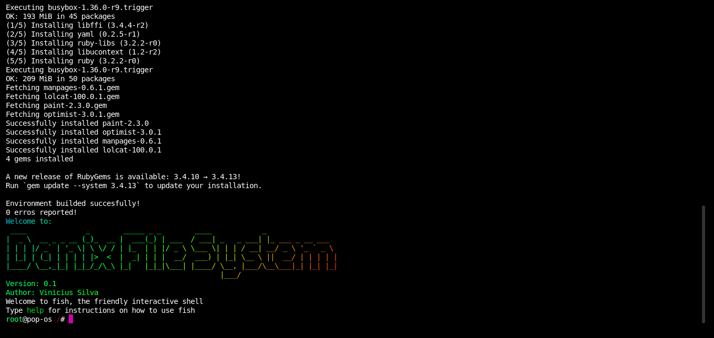
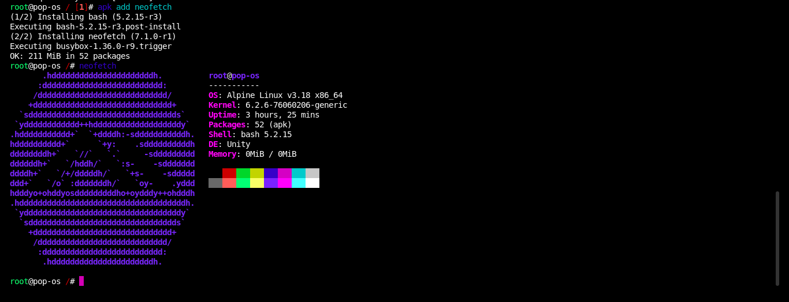

<html>
<center></center>
</html>

* Author: Vinicius F. da Silva
* Version 0.1
* Released: 2023

A very simple subsystem builder!

The Danixfs is a root filesystem management! Build a Alpine subsystem and pre install
essentials packages and compiers from languanges choice by user: 

Avaliable system arguments:

* "clike" : Build a C/C++ environment, installing from template with cpp, g++ and clang compilers


# Image:

#### Building a clike environment




### System Environments

![[img_iv.png]]
### Environments Snapthots

![[img_v.png]]

# Run Danix

```shell 
$ sudo make config
```

```shell 
$ sudo python main.py -h
```

![[img.vi.png]]