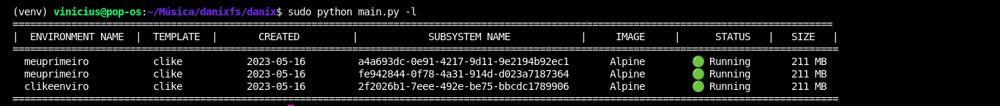
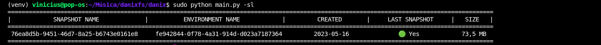
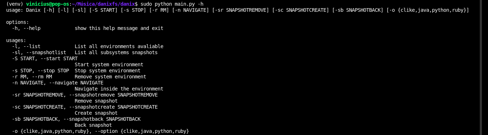

<html>
<center></center>
</html>

* Author: Vinicius F. da Silva
* Version 0.1.4
* Released: 2023

A very simple subsystem builder!

The Danixfs is a root filesystem management! Build a Alpine subsystem and pre install
essentials packages and compilers from languages choice by user: 
# Image:

#### Building a clike environment


### System Environments


### Environments Snapthots




# Required packages

    * curl 7.81.0 or higher 
    * tar 1.34 or higher 
    * python3 or higher
    * pip3 or higher
    * python-is-python3
# Install Danix

```shell
$ cd danixfs
```


```shell 
$ sudo make install
```

To clean configuration run:

```shell
$ sudo make clean
```

```shell 
$ danix -h
```



# Remove Danix

To remove danix run:
```shell
$ sudo danixclean
```
# Common erros


To fix this problem open file *registry.py*

Search for 

```python
raise RuntimeError("populate() isn't reentrant")" 
```

line. And replace by following code:

```python
self.app_configs = {}
```

Save file and run


```shell
$ sudo make clean
```


```shell
$ sudo make install
```

```shell
$ sudo make aliases
```

Close terminal, open again and run

```shell
$ danix --help
```
